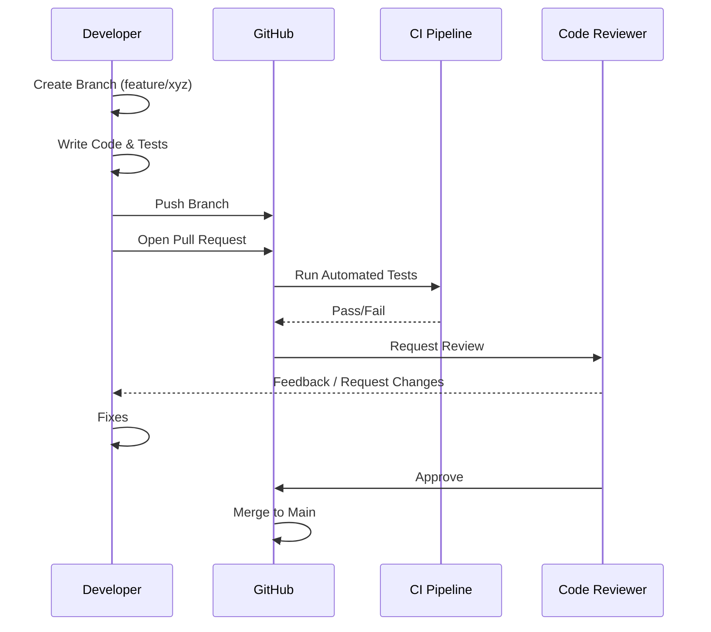

# Contributing Guidelines

Status: **Private Repository**
Accepting Contributions: **Authorized Personnel Only**

---

## 1. Introduction

Welcome to the team! This document serves as the "Rulebook" for contributing to our codebase. Our goal is to maintain a high-quality, scalable, and maintainable product. Please read this guide carefully before submitting your first Pull Request.

## 2. Getting Started

### Prerequisites
Ensure you have the following installed:
*   [Node.js](https://nodejs.org/) (Version LTS 20+)
*   [Git](https://git-scm.com/)
*   Package Manager: `npm` or `yarn` or `bun` (Standardize on: **npm**)

### Local Development Setup
1.  **Clone the Repository**
    ```bash
    git clone https://github.com/[org]/[repo].git
    cd [repo]
    ```
2.  **Install Dependencies**
    ```bash
    npm install
    ```
3.  **Environment Variables**
    *   Copy `.env.example` to `.env`
    *   Populate required keys (Ask a team lead for access to dev keys).
4.  **Run the Dev Server**
    ```bash
    npm run dev
    ```

## 3. Development Workflow

We strictly follow a feature-branch workflow.

### Branch Naming Convention
*   **Features**: `feature/short-description` (e.g., `feature/user-auth`, `feature/payment-integration`)
*   **Bug Fixes**: `fix/issue-description` (e.g., `fix/mobile-nav-bug`)
*   **Hotfixes**: `hotfix/critical-error` (Used only for urgent production patches)
*   **Documentation**: `docs/update-readme`
*   **Refactor**: `refactor/optimize-images`

### The Lifecycle of a Contribution


## 4. Coding Standards

### General Rules
*   **DRY (Don't Repeat Yourself)**: Create reusable utilities and components.
*   **Comments**: Explain *why*, not *what*. Code should be self-documenting where possible.
*   **No Magic Numbers**: Use constants or configuration files.

### Technology Specifics
*   **React/Next.js**: Use Functional Components and Hooks. Avoid Class components.
*   **TypeScript**:
    *   **Strict Mode**: Enabled.
    *   **No `any`**: explicitly define interfaces and types.
*   **CSS/Tailwind**:
    *   Use utility classes first.
    *   Abstract complex patterns into `components` or `layer` directives if reused > 3 times.

## 5. Pull Request (PR) Checklist

Before submitting your PR, ensure you have done the following:

- [ ] **Self-Review**: Have you read through your own diff?
- [ ] **Linting**: Did you run `npm run lint` and fix all warnings?
- [ ] **Build**: Does `npm run build` succeed without errors?
- [ ] **Testing**: Did you add tests for new features? Do existing tests pass?
- [ ] **Screenshots**: Attached before/after screenshots for any UI changes.
- [ ] **Description**: Clearly explained the business value and technical approach.

## 6. Communication

*   **Questions**: Post in the team Slack/Discord channel `#dev`.
*   **Bugs**: Open a GitHub Issue with the "Bug" label.
*   **Suggestions**: Open a GitHub Issue with the "Enhancement" label.
