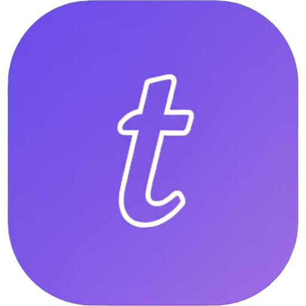
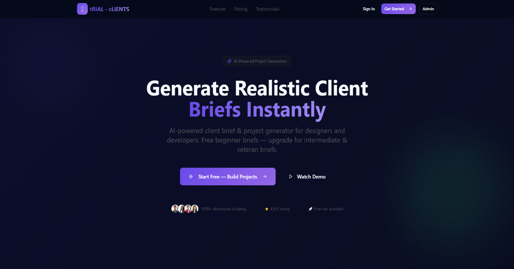
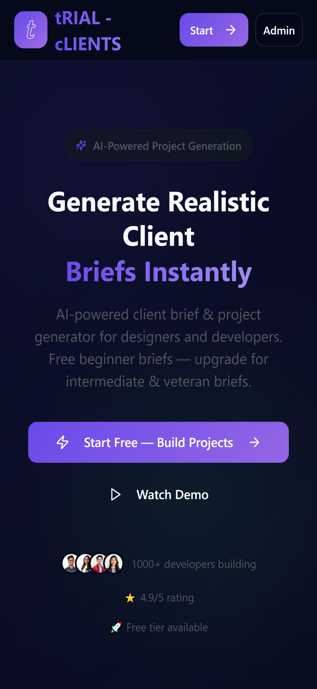
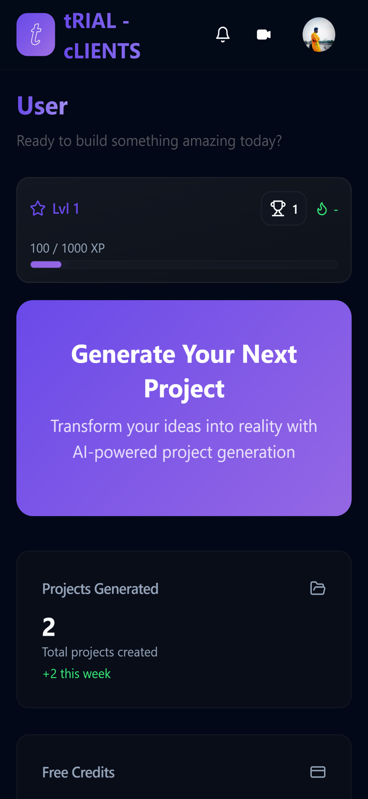
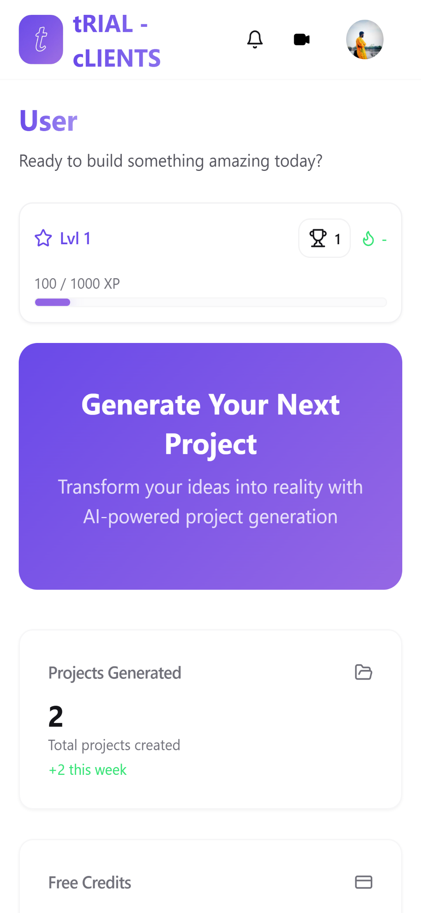
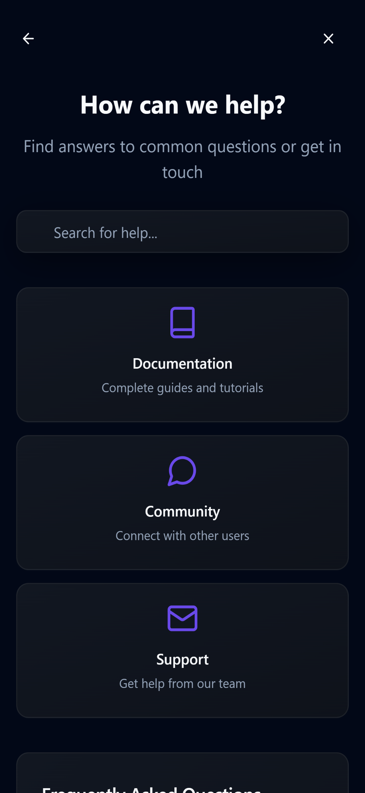

# tRIAL-CLIENTS

  
   
  <h1>Generate Realistic AI-Powered Client Briefs</h1>
  

    <b>Master your craft with production-grade project simulations.</b>
  

---

## 🚀 Project Overview

**tRIAL-CLIENTS** is a specialized SaaS platform designed for developers and designers who want to bridge the gap between tutorials and real-world project delivery.

---

## 😓 Problem Users Face

Many learners can follow tutorials and copy code, but they still struggle when they face real client work. In the real world, project requirements are often vague, priorities change, budgets are limited, timelines are tight, and clients expect solutions that are both practical and professional.

This creates a major gap between learning syntax and actually building production-ready work that looks and feels like a real project.

---

## ✅ Why Use It / How It Solves the Problem

tRIAL-CLIENTS solves this by generating realistic client briefs that simulate actual freelance and agency work. Instead of generic practice prompts, users get detailed project requirements, specific constraints, and technical needs that mirror professional delivery.

This helps users:

- practice with realistic client-style scenarios,
- improve problem-solving under constraints,
- build stronger portfolio projects,
- and get experience that feels much closer to real industry work.

---

## 🛠️ Tech Stack

- **Frontend:** React, TypeScript, Vite
- **Styling:** Tailwind CSS
- **Backend / Database:** Supabase, PostgreSQL
- **Authentication:** Supabase Auth
- **Deployment:** Vercel

---

## 📸 Interface

### Landing Page

### Mobile Experience

<table>
  <tr>
    <td width="25%"></td>
    <td width="25%"></td>
    <td width="25%"></td>
    <td width="25%"></td>
  </tr>
</table>

---

## ✨ Features

- **AI-Powered Brief Generation**: Get unique, detailed project requests every time. No two briefs are the same.
- **Role-Based Tracks**: Select specialized paths for **Developers** (technical focus) or **Designers** (visual/UX focus).
- **Realistic Constraints**: Projects include budgets, timelines, specific tech stack requirements, and "client" preferences.
- **Project Workspace**: A dedicated dashboard to manage your active briefs, track progress, and organize your deliverables.
- **Credit & Reward System**: A gamified economy where you earn credits for completing tasks, ensuring sustainable usage of the AI tools.
- **History & Portfolio**: Automatically save your generated briefs to build a comprehensive history of your practice work.
- **Production-Ready UI**: Built with a modern, responsive interface ensuring a seamless experience across desktop and mobile devices.

---

## 🌐 How to Use

This application is fully deployed and ready for use. No local installation is required.

1. **Access the Platform**:  
   👉 **[https://trial-clients.vercel.app](https://trial-clients.vercel.app)**

2. **Sign Up**: Create an account to save your history and manage credits.
3. **Choose Your Path**: Select whether you want a Design or Development challenge.
4. **Generate**: Click to receive your first client brief and start building!

---

  © 2026 tRIAL - cLIENTS. All rights reserved.

