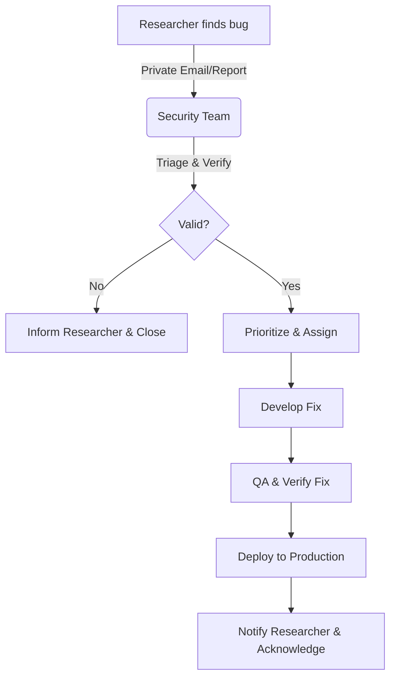

# Security Policy & Vulnerability Reporting

We are dedicated to maintaining the security and integrity of our user data and infrastructure. This document outlines our policy for responsible disclosure and our promise to researchers who work with us in good faith.

## 1. Reporting a Vulnerability

We strongly encourage the reporting of security issues. If you believe you have found a vulnerability, please report it to us immediately.

### **Contact Information**
*   **Primary Contact**: ` help.trialclients@gmail.com` 
*   **PGP Key**: (Optional: Insert Key ID here if available)
*   **Platform**: GitHub Security Advisories (Private Reporting)

### **What to Include in Your Report**
To help us triage and fix the issue quickly, please include:
1.  **Vulnerability Type**: (e.g., SQL Injection, XSS, RCE, IDOR)
2.  **Severity Level**: Your assessment (Low, Medium, High, Critical)
3.  **Affected Component**: URL, API endpoint, or file path.
4.  **Steps to Reproduce**: A clear, step-by-step guide or script.
5.  **Proof of Concept**: Screenshots, video, or code snippets (ensure no real user data is exposed).

## 2. Response Timeline (SLA)

We are committed to a prompt response:

| Milestone           | Timeline Goal     |
|---------------------|-------------------|
| **First Response**  | Within 24 hours   |
| **Triage & Review** | Within 3 days     |
| **Fix Development** | Within 5-10 days  |
| **Fix Deployment**  | Immediate post-QA |

## 3. Scope of Vulnerabilities

Please focus your auditing efforts on the following areas:

### **In Scope (Priority)**
*   Remote Code Execution (RCE)
*   Broken Authentication / Session Management
*   Insecure Direct Object References (IDOR)
*   SQL/NoSQL Injection
*   Cross-Site Scripting (XSS) (Stored/Reflected in sensitive areas)
*   Cross-Site Request Forgery (CSRF) on state-changing actions
*   Sensitive Data Exposure (PII, Credentials)

### **Out of Scope (Do Not Report)**
*   **UI/UX bugs** (e.g., spelling mistakes, harmless visual glitches).
*   **Self-XSS** (requiring a user to paste code into their own console).
*   **Clickjacking** on pages with no sensitive actions.
*   **Social Engineering** (phishing) of our employees or users.
*   **Denial of Service** (DoS/DDoS) - please do not attempt to degrade our service availability.

## 4. Responsible Disclosure Workflow

## 5. Safe Harbor Policy

We consider security research to be a valuable activity. If you conduct your research and reporting in accordance with this policy, we will:
*   **Not pursue legal action** against you related to your research.
*   **Work with you** to understand and resolve the issue quickly.
*   **Recognize your contribution** in our Security Hall of Fame (if you wish).

**Rules of Engagement:**
*   Do not access, modify, or delete user data that does not belong to you.
*   Do not disrupt production services.
*   Do not disclose the vulnerability to the public until specific written consent is given or a fix is deployed.

Thank you for helping keep our platform safe!
